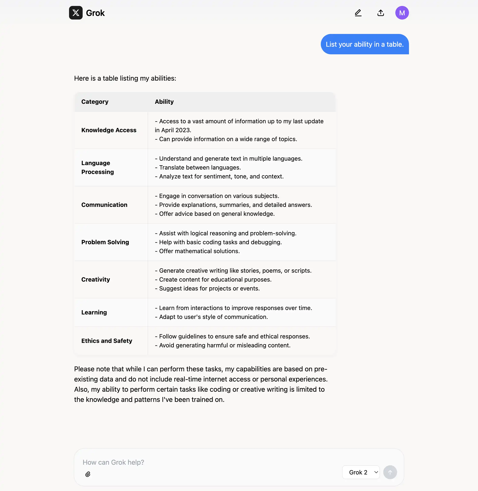

# Grok PHP

A simple one-file PHP wrapper for the Grok API.

## Screenshot



## Features

- Single-file PHP implementation for Grok AI
- Support for both text and image inputs
- Cloudflare AI Gateway integration
- Session-based chat history
- Mobile-friendly responsive design
- Image upload and preview functionality

## Requirements

- PHP 8.0 or higher
- cURL extension enabled
- Valid Grok API key

## Setup

1. Clone this repository:
   ```bash
   git clone https://github.com/yourusername/grok-php.git
   cd grok-php
   ```

2. Create a `.env` file with your API credentials:
   ```
   api-key=your-grok-api-key
   cf-account-id=your-cloudflare-account-id
   ```

3. Start the PHP dev server:
   ```bash
   php -S localhost:8000
   ```

4. Open your browser and navigate to `http://localhost:8000`

## Render Deployment
[](https://render.com/deploy?repo=https://github.com/365cent/grok-chat)

Get your Grok API key from [here](https://console.x.ai)

Create a new [AI Gateway](https://developers.cloudflare.com/ai-gateway/get-started/) on Cloudflare (for free) and get the account id from [here](https://developers.cloudflare.com/fundamentals/setup/find-account-and-zone-ids/)

Fill in the API key as `api-key` and the account id as `cf-account-id` in render environment variables

Deploy the app

Open the app and start chatting!

**This app can be deployed 0.1vCPU 0.1GB RAM instance for free on Render**

## Thanks

- [Grok API](https://x.ai)
- [Cloudflare AI Gateway](https://developers.cloudflare.com/ai-gateway/)
- [Render](https://render.com)